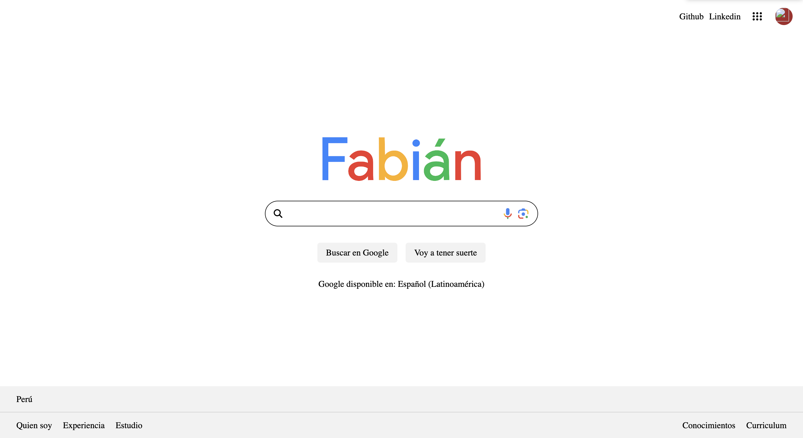

# 🚀 Portfolio3 - Clon de Google Personalizado

Un clon personalizado de la página principal de Google desarrollado con **Vue.js 3**, que simula la interfaz de búsqueda de Google pero con mi toque personal.

## 📸 Vista Previa



## ✨ Características

- 🎨 **Interfaz idéntica a Google** con personalización propia
- 📱 **Diseño completamente responsive** 
- 🔍 **Campo de búsqueda funcional** con iconos de micrófono y cámara
- 🎯 **Navegación entre páginas** con Vue Router
- 💫 **Efectos hover** en botones e iconos
- 📦 **Componentes Vue organizados** (Header, Main, Footer)
- 🌐 **Font Awesome** para iconos

## 🛠️ Tecnologías Utilizadas

- **Vue.js 3** - Framework principal
- **Vue Router** - Navegación entre páginas
- **Font Awesome** - Iconografía
- **CSS3** - Estilos y responsive design
- **JavaScript ES6+** - Lógica de la aplicación

## 🚀 Instalación y Uso

### Prerrequisitos
- Node.js (v14 o superior)
- npm o yarn

### Pasos de instalación

1. **Clona el repositorio**
   ```bash
   git clone https://github.com/Fabian1803/portfolio3.git
   cd portfolio3
   ```

2. **Instala las dependencias**
   ```bash
   npm install
   ```

3. **Ejecuta el servidor de desarrollo**
   ```bash
   npm run serve
   ```

4. **Abre tu navegador en** `http://localhost:8080`

## 📦 Scripts Disponibles

### Desarrollo
```bash
npm run serve
```
Compila y recarga automáticamente para desarrollo

### Producción
```bash
npm run build
```
Compila y minifica para producción

### Linting
```bash
npm run lint
```
Analiza y corrige archivos

## 📁 Estructura del Proyecto

```
src/
├── assets/          # Imágenes y recursos
│   ├── logo.png
│   └── icon/
│       ├── camaraIcon.png
│       └── microIcon.png
├── components/      # Componentes
│   ├── home/
│   │   ├── HomeHeader.vue
│   │   ├── HomeMain.vue
│   │   ├── HomeFooter.vue
│   │   └── index.js
│   └── fabian/
│       ├── FabianHeader.vue
│       ├── FabianMain.vue
│       └── FabianFooter.vue
├── router/          # Configuración de rutas
│   └── index.js
├── views/           # Páginas principales
│   ├── HomePage.vue
│   └── FabianPage.vue
├── App.vue         # Componente raíz
└── main.js         # Punto de entrada
```

## 🎯 Funcionalidades

### Página Principal (HomePage)
- Logo personalizado "Fabián" con colores de Google
- Campo de búsqueda con iconos funcionales
- Botones "Buscar en Google" y "Voy a tener suerte"
- Footer con enlaces informativos
- Header con enlaces a GitHub y LinkedIn

### Responsive Design
- ✅ Desktop (1200px+)
- ✅ Tablet (600px - 1199px)
- ✅ Mobile (< 600px)

## 🔮 Próximas Características

- [ ] Funcionalidad de búsqueda real
- [ ] Modo oscuro/claro
- [ ] Animaciones avanzadas
- [ ] Más páginas del portfolio
- [ ] Integración con APIs

## 📄 Licencia

Este proyecto está bajo la Licencia MIT - ve el archivo [LICENSE](LICENSE) para más detalles.

## 🤝 Contribuciones

Las contribuciones son bienvenidas. Para cambios importantes:

1. Haz fork del proyecto
2. Crea tu Feature Branch (`git checkout -b feature/AmazingFeature`)
3. Commit tus cambios (`git commit -m 'Add some AmazingFeature'`)
4. Push al Branch (`git push origin feature/AmazingFeature`)
5. Abre un Pull Request

---

⭐ **¡No olvides darle una estrella al proyecto si te gustó!** ⭐